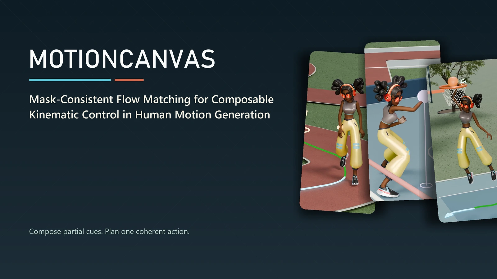
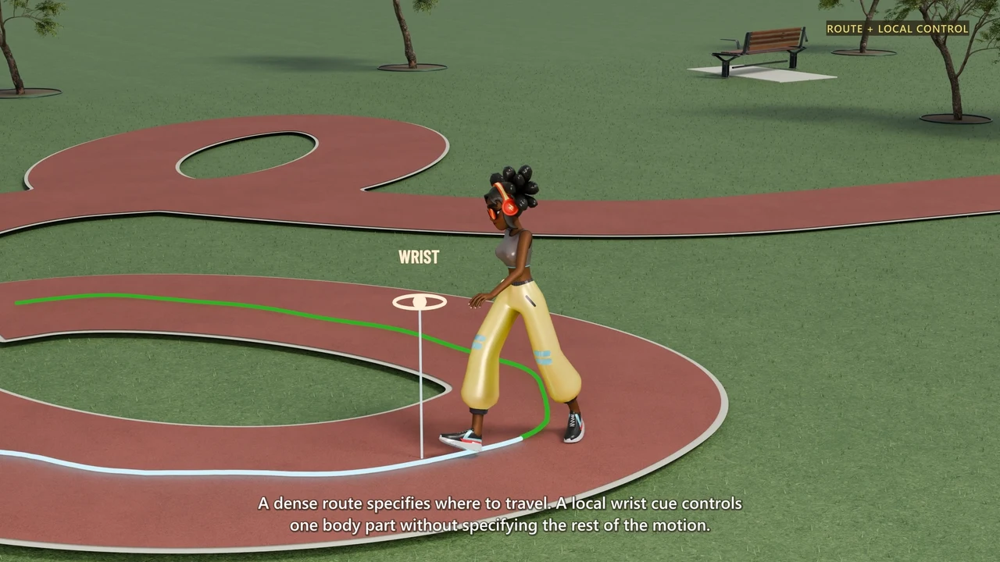
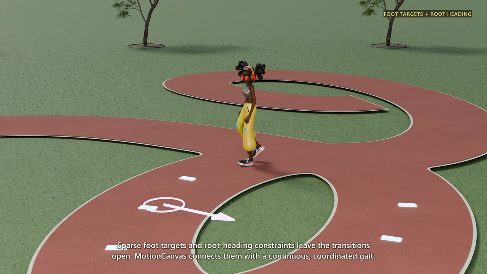
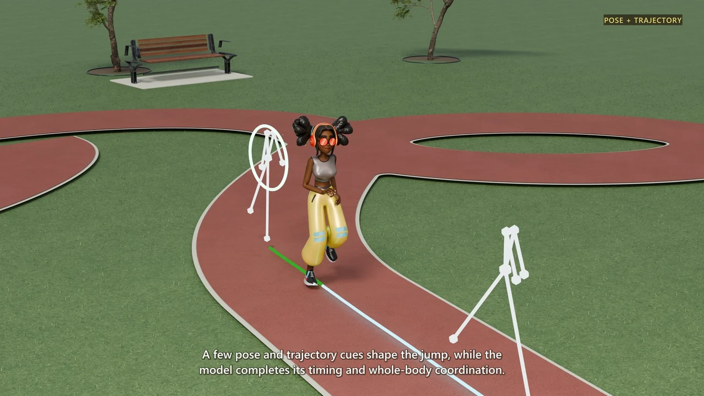
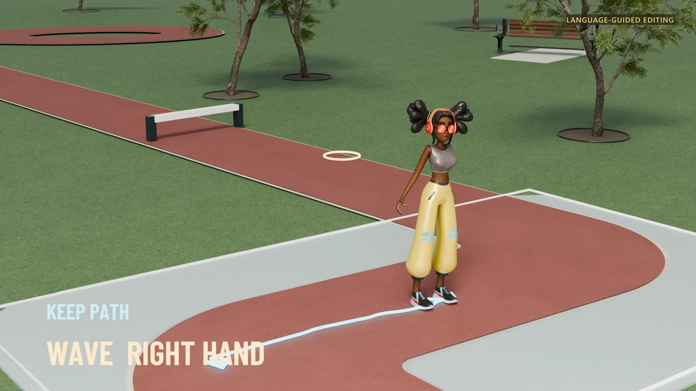
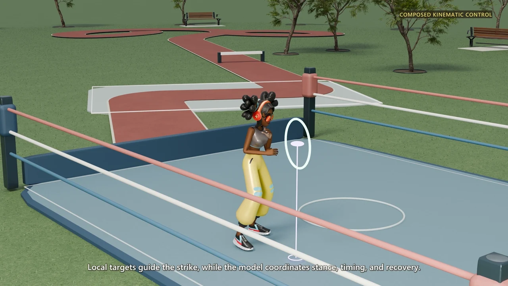
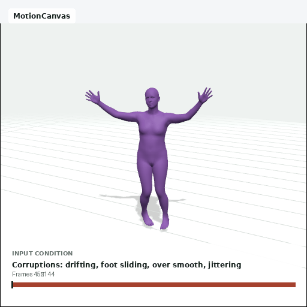

# MotionCanvas

### Mask-Consistent Flow Matching for Composable Kinematic Control in Human Motion Generation

**Your cues. One coherent motion.**

[Project page](https://zeyuling.github.io/MotionCanvas/) · [Full video](https://zeyuling.github.io/MotionCanvas/#demo) · [Hugging Face benchmarks](https://huggingface.co/spaces/ZeyuLing/temporal-condition-leaderboard) · [Paper — coming soon](#paper) · [Code — coming soon](#code)

Zeyu Ling · Di Kang · Qing Shuai · Yuxin Wen · Jing Li · Zhanke Wang · Linchao Bao · Chunchao Guo

Zhejiang University · Hunyuan3D Team, Tencent · Peking University

<b><a href="https://zeyuling.github.io/MotionCanvas/#demo">▶ Watch the complete 2:38 film</a></b> · <a href="https://zeyuling.github.io/MotionCanvas/assets/media/motioncanvas-v52-1080p.mp4">1080p MP4</a> · <a href="https://github.com/ZeyuLing/MotionCanvas/releases/download/demo-v52/motioncanvas-demo-1440p.mp4">1440p original</a>

Motion creation rarely begins with a complete frame-by-frame specification. An animator may place a
pose, draw a route, direct one body part, preserve an existing region, or describe an edit in language.
**MotionCanvas** brings these kinematic cues onto a shared time–kinematic-variable canvas. One
conditional generator organizes how the complete action connects them.

## Character showcase

Selected excerpts from the rendered demonstration. Click a preview to watch the corresponding clip.

<table>
  <tr>
    <td width="50%" valign="top"> <b>Route &amp; local control</b> A prescribed route guides travel; a wrist cue adds a local target to the same motion.</td>
    <td width="50%" valign="top"> <b>Footsteps &amp; heading</b> Foot targets and facing constraints leave the intervening motion to the model.</td>
  </tr>
  <tr>
    <td width="50%" valign="top"> <b>Pose &amp; trajectory</b> A jump combines pose and path constraints with whole-body coordination.</td>
    <td width="50%" valign="top"> <b>Language-guided editing</b> An existing motion provides context; language directs the change in gesture.</td>
  </tr>
  <tr>
    <td width="50%" valign="top"> <b>Composed kinematic cues</b> Local cues guide the hands as the body coordinates stance and recovery.</td>
    <td width="50%" valign="top"> <b>Timed spatial target</b> The hoop position is supplied at the dunk time to guide the complete action.</td>
  </tr>
</table>

The project page includes individual players, chapter navigation, and the complete narration transcript.

## Benchmark samples

These samples are MotionCanvas inference results from the public Motius evaluation viewers, separate
from the rendered character showcase above.

<table>
  <tr>
    <td width="50%" valign="top"> <b>Text-to-motion · HumanML3D</b> Language-only generation, without kinematic cues. <a href="https://zeyuling-t2m-humanml3d-leaderboard.static.hf.space/cases/index.html?method=motioncanvas&amp;case=004822">Inspect case 004822 and comparisons ↗</a></td>
    <td width="50%" valign="top"> <b>Motion repair · BrokenAMASS</b> Repair a corrupted motion using known affected regions. <a href="https://zeyuling-motion-repair-brokenamass-leaderboard.static.hf.space/cases/index.html?method=motioncanvas&amp;case=repair_000">Inspect case repair_000 and comparisons ↗</a></td>
  </tr>
</table>

Explore more results and task settings:

- [Temporal control](https://huggingface.co/spaces/ZeyuLing/temporal-condition-leaderboard) and [body-part control](https://huggingface.co/spaces/ZeyuLing/body-part-condition-humanml3d-leaderboard)
- [Sequential generation](https://huggingface.co/spaces/ZeyuLing/babel-sequential-generation-leaderboard)
- [Instruction editing](https://huggingface.co/spaces/ZeyuLing/instruction-editing-leaderboard) and [style–content editing](https://huggingface.co/spaces/ZeyuLing/motion-edit-leaderboard)
- [Motion repair](https://huggingface.co/spaces/ZeyuLing/motion-repair-brokenamass-leaderboard)

## Method at a glance

Heterogeneous kinematic cues share one motion canvas. Mask-consistent flow matching learns to
complete motion around the supplied assignments; geometric and transition objectives support
coherent completion.

## Resources

| Resource | Availability |
| --- | --- |
| Project page and full video | [Available](https://zeyuling.github.io/MotionCanvas/) |
| MotionCanvas model | Hugging Face download link coming soon |
| Training and inference code | Coming soon |
| Paper and citation | Coming soon |

### Paper

The paper link and BibTeX will be added here upon release.

### Code

The dedicated training and inference code release is coming soon. Follow this repository for updates.

---

[Media sources](assets/media-manifest.json) · [Media notes](MEDIA.md) · [Motius](https://github.com/ZeyuLing/Motius)
