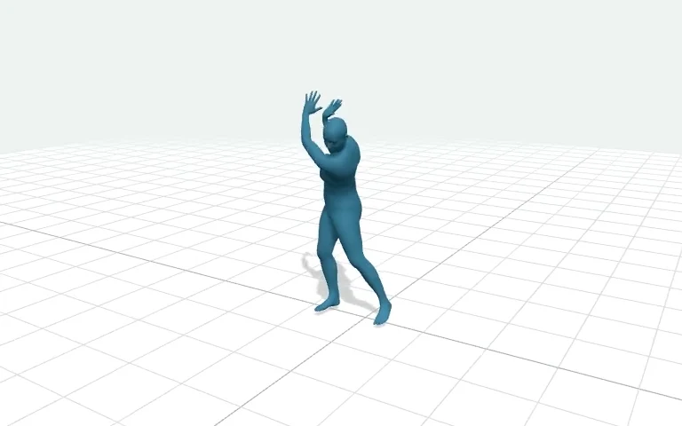
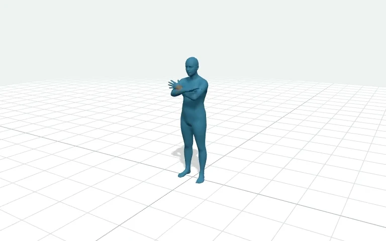
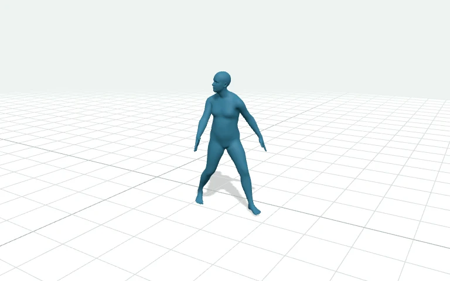
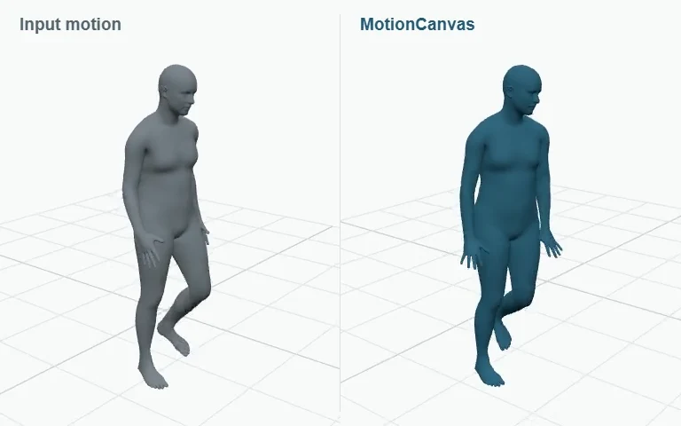
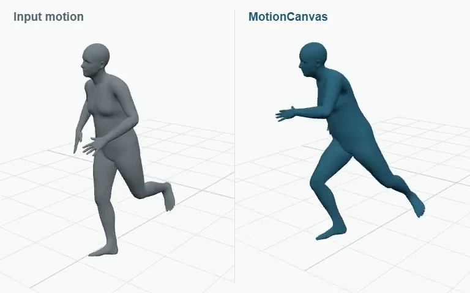
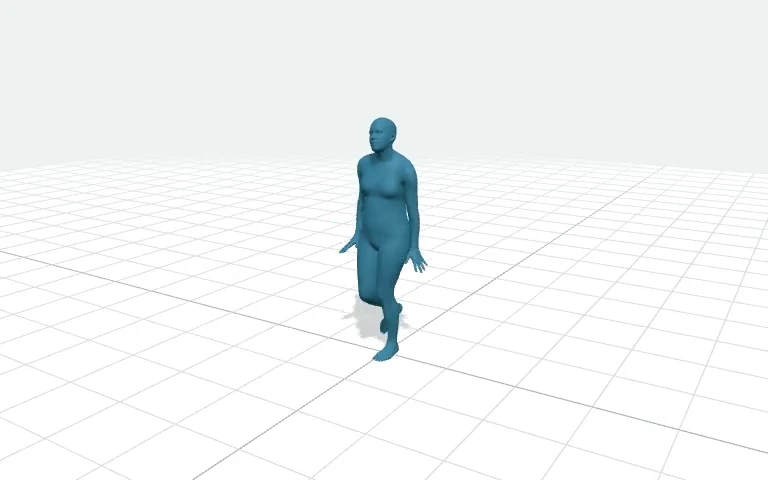
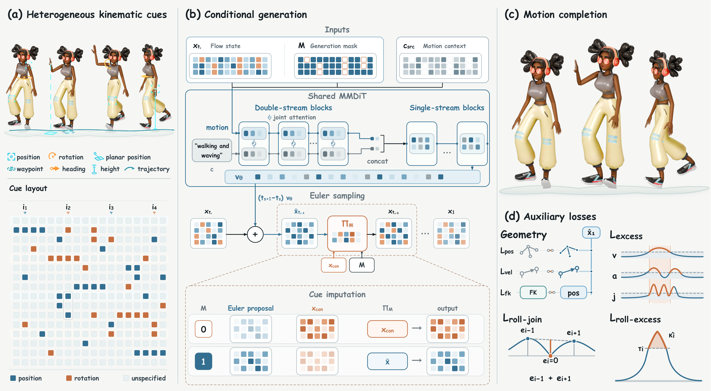

  

<h3 align="center">Learning Implicit Motion Planning from Composable Kinematic Cues</h3>

  <b><a href="https://zeyuling.github.io/MotionCanvas/">Project page</a></b> &nbsp; / &nbsp;
  <b><a href="https://zeyuling.github.io/MotionCanvas/#demo">Full video</a></b> &nbsp; / &nbsp;
  <b><a href="#benchmark-gallery">Benchmark gallery</a></b> &nbsp; / &nbsp;
  <b><a href="#resources">Paper &amp; code</a></b> &nbsp; / &nbsp;
  <b><a href="#hugging-face">Hugging Face</a></b>

---

**Compose kinematic cues. Generate coherent motion.** MotionCanvas connects
cue-prescribed partial states into a coherent full-body trajectory. A shared flow-matching
model generates motion from position and rotation cues, with optional language and input
motion for editing. Cue imputation preserves the specified canvas values throughout generation.

## Watch MotionCanvas

The complete **2:38 narrated film** combines kinematic control, motion editing, and character
animation. Explore individual scenes below, or watch it end to end.

<b><a href="https://zeyuling.github.io/MotionCanvas/#demo">▶ Full film with chapters</a></b> &nbsp; · &nbsp; <a href="https://zeyuling.github.io/MotionCanvas/assets/media/motioncanvas-v54-editorial-1080p.mp4">1080p MP4</a> &nbsp; · &nbsp; <a href="https://github.com/ZeyuLing/MotionCanvas/releases/download/demo-v54-editorial/motioncanvas-demo-1440p.mp4">1440p original</a>

<table>
  <tr>
    <td width="33%" align="center"> <b>Routes &amp; local targets</b></td>
    <td width="33%" align="center"> <b>Footsteps &amp; heading</b></td>
    <td width="33%" align="center"> <b>Key poses &amp; trajectories</b></td>
  </tr>
  <tr>
    <td width="33%" align="center"> <b>Language-guided editing</b></td>
    <td width="33%" align="center"> <b>Composed hand controls</b></td>
    <td width="33%" align="center"> <b>Timed spatial targets</b></td>
  </tr>
</table>

## Benchmark gallery

**24 MotionCanvas inference cases — four per benchmark.** The six collections cover
temporal control, body-part control, sequential generation, instruction editing,
style–content editing, and text-to-motion.

Each preview links to its full clip and source viewer. For edits, **input motion is on the left**
and **MotionCanvas is on the right**. Temporal previews distinguish supplied poses (amber) from generated motion (blue).
The orange marker identifies the controlled wrist. [Color guide and complete previews →](https://zeyuling.github.io/MotionCanvas/#benchmarks)

<table>
<tr>
<td width="50%" valign="top"> <b>Temporal control</b> <a href="https://zeyuling.github.io/MotionCanvas/?benchmark=temporal#benchmarks">Watch all 4 cases →</a></td>
<td width="50%" valign="top"> <b>Body-part control</b> <a href="https://zeyuling.github.io/MotionCanvas/?benchmark=body#benchmarks">Watch all 4 cases →</a></td>
</tr>
<tr>
<td width="50%" valign="top"> <b>Sequential generation</b> <a href="https://zeyuling.github.io/MotionCanvas/?benchmark=sequential#benchmarks">Watch all 4 cases →</a></td>
<td width="50%" valign="top"> <b>Instruction editing</b> <a href="https://zeyuling.github.io/MotionCanvas/?benchmark=instruction#benchmarks">Watch all 4 cases →</a></td>
</tr>
<tr>
<td width="50%" valign="top"> <b>Style–content editing</b> <a href="https://zeyuling.github.io/MotionCanvas/?benchmark=editing#benchmarks">Watch all 4 cases →</a></td>
<td width="50%" valign="top"> <b>Text-to-motion</b> <a href="https://zeyuling.github.io/MotionCanvas/?benchmark=text#benchmarks">Watch all 4 cases →</a></td>
</tr>
</table>

<b><a href="https://zeyuling.github.io/MotionCanvas/#benchmarks">Browse all cases with task filters →</a></b>

## One canvas, coherent completion

- **Compose the cues.** Key poses, trajectories, local position and rotation targets share a
  time–kinematic-variable canvas.
- **Plan the motion.** One shared flow model connects cue-prescribed partial states into a
  coherent full-body trajectory; cue imputation preserves specified canvas values.
- **Edit in context.** Language and input motion support changes to an existing action.

## Resources

| Resource | Status |
| :--- | :--- |
| Project page & video | [Explore MotionCanvas](https://zeyuling.github.io/MotionCanvas/) |
| Paper & citation | Coming soon |
| Training & inference code | Coming soon |
| Hugging Face model | Coming soon |
| Benchmark viewers | Available below |

### Hugging Face

[Temporal control](https://huggingface.co/spaces/ZeyuLing/temporal-condition-leaderboard) ·
[Body-part control](https://huggingface.co/spaces/ZeyuLing/body-part-condition-humanml3d-leaderboard) ·
[Sequential generation](https://huggingface.co/spaces/ZeyuLing/babel-sequential-generation-leaderboard) ·
[Instruction editing](https://huggingface.co/spaces/ZeyuLing/instruction-editing-leaderboard) ·
[Style & content editing](https://huggingface.co/spaces/ZeyuLing/motion-edit-leaderboard) ·
[Text-to-motion](https://huggingface.co/spaces/ZeyuLing/t2m-humanml3d-leaderboard)

Follow this repository for the paper, model, and dedicated code release.

---

[Media provenance](assets/media-manifest.json) · [Media notes](MEDIA.md) · [Motius](https://github.com/ZeyuLing/Motius)
