

  <a href="https://zeyuling.github.io/MotionCanvas/#demo">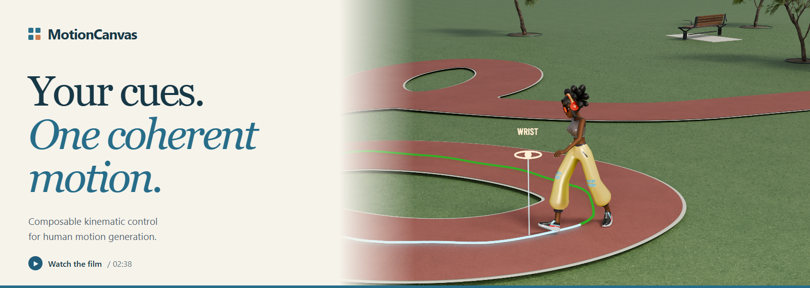</a>

<h3 align="center">Mask-Consistent Flow Matching for Composable Kinematic Control in Human Motion Generation</h3>

  <b><a href="https://zeyuling.github.io/MotionCanvas/">Project page</a></b> &nbsp; / &nbsp;
  <b><a href="https://zeyuling.github.io/MotionCanvas/#demo">Full video</a></b> &nbsp; / &nbsp;
  <b><a href="#benchmark-gallery">Benchmark gallery</a></b> &nbsp; / &nbsp;
  <b><a href="#resources">Paper &amp; code</a></b> &nbsp; / &nbsp;
  <b><a href="#hugging-face">Hugging Face</a></b>

---

**Give the motion a pose, a path, a local target, or an edit.** MotionCanvas organizes a
coherent full-body action around these cues. A shared motion canvas and mask-consistent
flow matching bring heterogeneous control requests into one generative model.

## Watch MotionCanvas

The complete **2:38 narrated film** combines kinematic control, motion editing, and character
animation. Explore individual scenes below, or watch it end to end.

<b><a href="https://zeyuling.github.io/MotionCanvas/#demo">▶ Full film with chapters</a></b> &nbsp; · &nbsp; <a href="https://zeyuling.github.io/MotionCanvas/assets/media/motioncanvas-v52-1080p.mp4">1080p MP4</a> &nbsp; · &nbsp; <a href="https://github.com/ZeyuLing/MotionCanvas/releases/download/demo-v52/motioncanvas-demo-1440p.mp4">1440p original</a>

<table>
  <tr>
    <td width="33%" align="center"><a href="https://zeyuling.github.io/MotionCanvas/assets/showcase/route.mp4">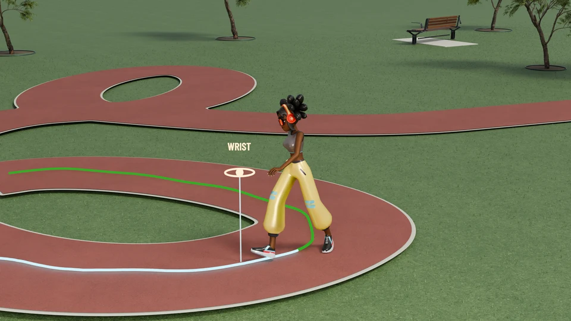</a> <b>Routes &amp; local targets</b></td>
    <td width="33%" align="center"> <b>Footsteps &amp; heading</b></td>
    <td width="33%" align="center"><a href="https://zeyuling.github.io/MotionCanvas/assets/showcase/jump.mp4">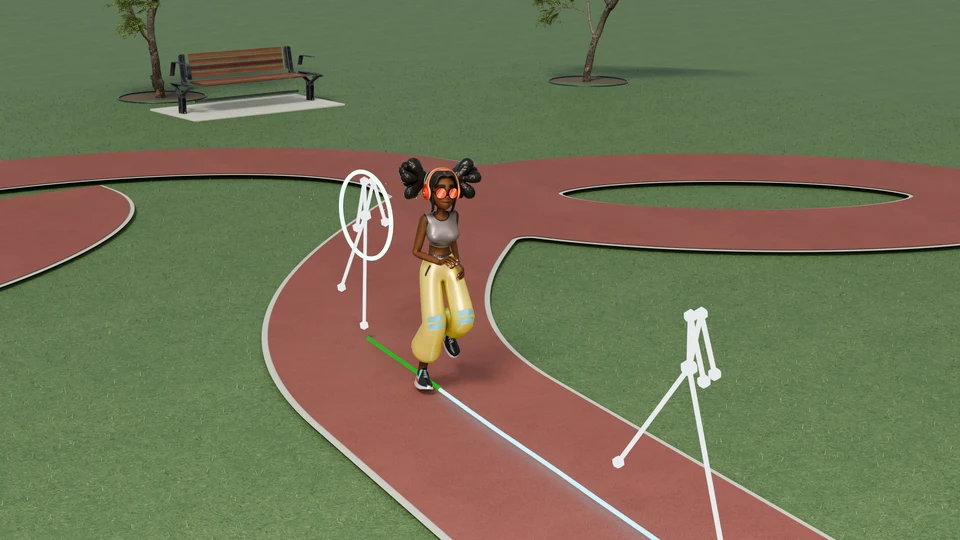</a> <b>Key poses &amp; trajectories</b></td>
  </tr>
  <tr>
    <td width="33%" align="center"><a href="https://zeyuling.github.io/MotionCanvas/assets/showcase/editing.mp4">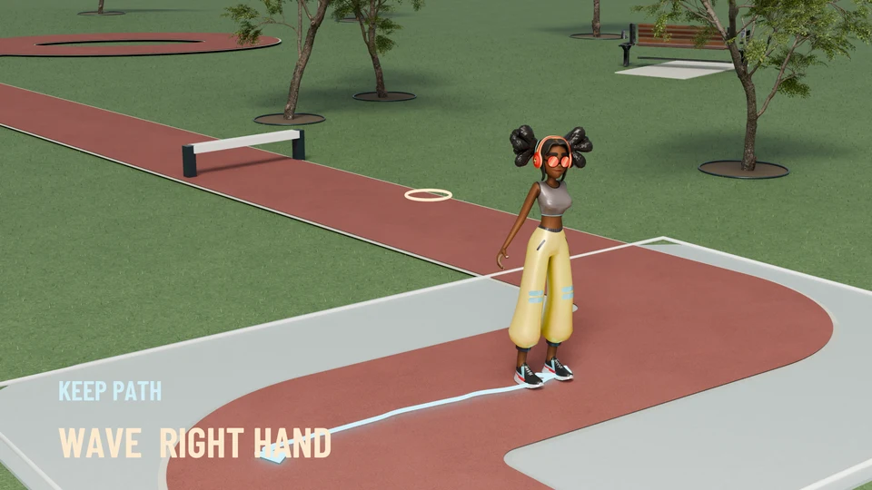</a> <b>Language-guided editing</b></td>
    <td width="33%" align="center"><a href="https://zeyuling.github.io/MotionCanvas/assets/showcase/boxing.mp4">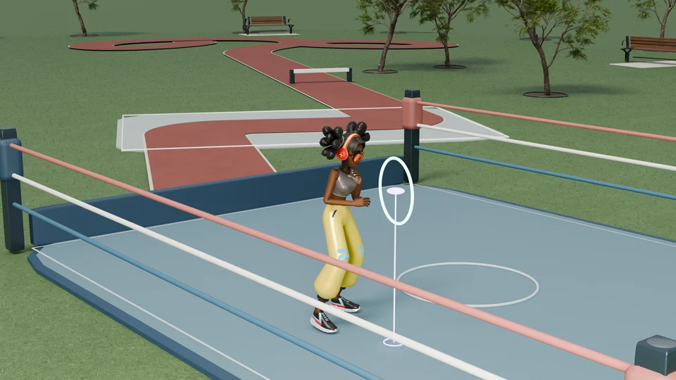</a> <b>Composed hand controls</b></td>
    <td width="33%" align="center"><a href="https://zeyuling.github.io/MotionCanvas/assets/showcase/basketball.mp4">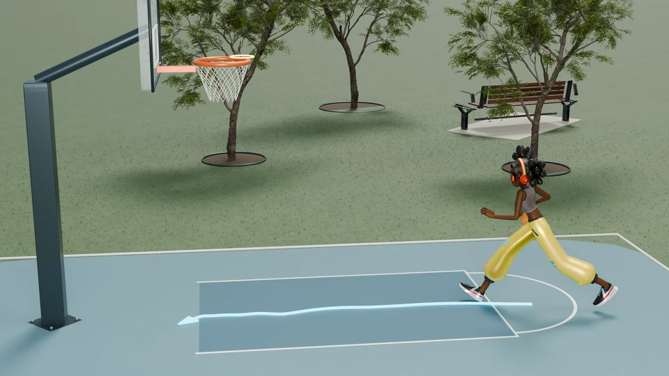</a> <b>Timed spatial targets</b></td>
  </tr>
</table>

## Benchmark gallery

**12 MotionCanvas inference cases**, selected from Motius across seven task categories.
The gallery covers temporal completion, body-part control, sequential generation, instruction
editing, style editing, content editing, and text-to-motion.

Each preview links to its full clip and source viewer. For edits, **input motion is on the left**
and **MotionCanvas is on the right**. In temporal previews, amber marks supplied poses; blue
marks generated frames. The local-control marker identifies the controlled wrist.

<table>
  <tr>
    <td width="50%" valign="top">
      <a href="https://zeyuling.github.io/MotionCanvas/#case-prediction"><picture><source media="(prefers-reduced-motion: reduce)" srcset="assets/benchmarks/prediction.webp" />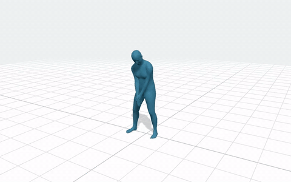</picture></a>
      <b>Motion prediction</b> 
      First pose + text
    </td>
    <td width="50%" valign="top">
      <a href="https://zeyuling.github.io/MotionCanvas/#case-body-part-reach"><picture><source media="(prefers-reduced-motion: reduce)" srcset="assets/benchmarks/body-part-reach.webp?case=003245" /></picture></a>
      <b>Coordinated arm raise</b> 
      Sparse wrist positions + text
    </td>
  </tr>
  <tr>
    <td width="50%" valign="top">
      <a href="https://zeyuling.github.io/MotionCanvas/#case-sequential"><picture><source media="(prefers-reduced-motion: reduce)" srcset="assets/benchmarks/sequential.webp?case=val_6604" /></picture></a>
      <b>Sequential generation</b> 
      Stand → walk left → stop
    </td>
    <td width="50%" valign="top">
      <a href="https://zeyuling.github.io/MotionCanvas/#case-instruction"><picture><source media="(prefers-reduced-motion: reduce)" srcset="assets/benchmarks/instruction.webp" />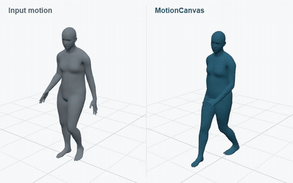</picture></a>
      <b>Instruction editing</b> 
      “Make a wider turn”
    </td>
  </tr>
  <tr>
    <td width="50%" valign="top">
      <a href="https://zeyuling.github.io/MotionCanvas/#case-style"><picture><source media="(prefers-reduced-motion: reduce)" srcset="assets/benchmarks/style.webp" />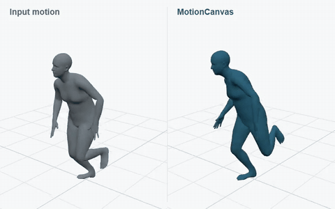</picture></a>
      <b>Style editing</b> 
      Keep hopping · add an angry style
    </td>
    <td width="50%" valign="top">
      <a href="https://zeyuling.github.io/MotionCanvas/#case-content"><picture><source media="(prefers-reduced-motion: reduce)" srcset="assets/benchmarks/content.webp" />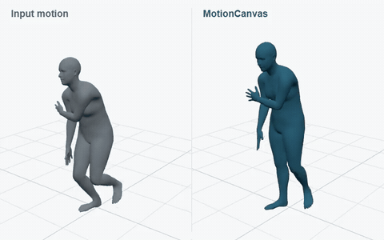</picture></a>
      <b>Content editing</b> 
      Hop → walk · retain the style
    </td>
  </tr>
  <tr>
    <td width="50%" valign="top">
      <a href="https://zeyuling.github.io/MotionCanvas/#case-keyframes"><picture><source media="(prefers-reduced-motion: reduce)" srcset="assets/benchmarks/keyframes.webp" />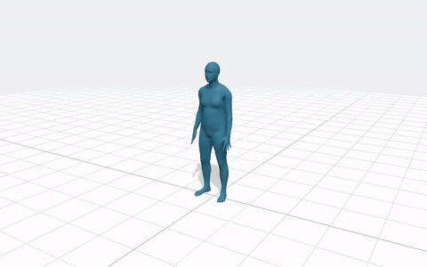</picture></a>
      <b>Sparse keyframes</b> 
      Scattered pose cues + text
    </td>
    <td width="50%" valign="top">
      <a href="https://zeyuling.github.io/MotionCanvas/#case-in-betweening"><picture><source media="(prefers-reduced-motion: reduce)" srcset="assets/benchmarks/in-betweening.webp" />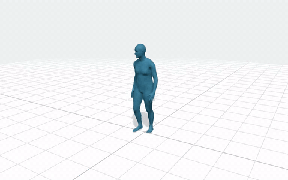</picture></a>
      <b>Motion in-betweening</b> 
      Endpoint poses + text
    </td>
  </tr>
  <tr>
    <td width="50%" valign="top">
      <a href="https://zeyuling.github.io/MotionCanvas/#case-no-text"><picture><source media="(prefers-reduced-motion: reduce)" srcset="assets/benchmarks/no-text.webp" />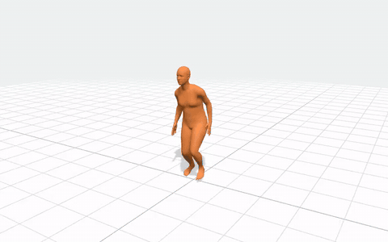</picture></a>
      <b>Motion-only continuation</b> 
      First 20% of frames · no text
    </td>
    <td width="50%" valign="top">
      <a href="https://zeyuling.github.io/MotionCanvas/#case-text-to-motion"><picture><source media="(prefers-reduced-motion: reduce)" srcset="assets/benchmarks/text-to-motion.webp" />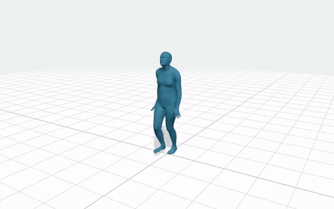</picture></a>
      <b>Text-to-motion</b> 
      Language alone · no kinematic cues
    </td>
  </tr>
  <tr>
    <td width="50%" valign="top">
      <a href="https://zeyuling.github.io/MotionCanvas/#case-body-part"><picture><source media="(prefers-reduced-motion: reduce)" srcset="assets/benchmarks/body-part.webp" />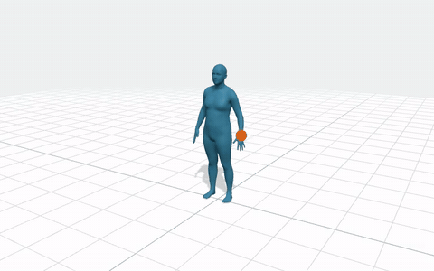</picture></a>
      <b>Local wrist control</b> 
      Sparse wrist positions + text
    </td>
    <td width="50%" valign="top">
      <a href="https://zeyuling.github.io/MotionCanvas/#case-sequential-lift"><picture><source media="(prefers-reduced-motion: reduce)" srcset="assets/benchmarks/sequential-lift.webp" />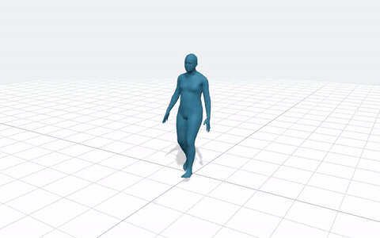</picture></a>
      <b>Sequential generation</b> 
      Walk → lift → walk back
    </td>
  </tr>
</table>

<b><a href="https://zeyuling.github.io/MotionCanvas/#benchmarks">Browse all cases with task filters →</a></b>

## One canvas, coherent completion

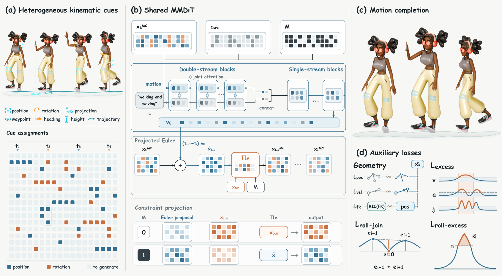

- **Compose the cues.** Key poses, trajectories, local position and rotation targets share a
  time–kinematic-variable canvas.
- **Plan the motion.** Mask-consistent flow matching organizes the unspecified motion around
  the supplied assignments.
- **Edit in context.** Language and input motion support changes to an existing action.

## Resources

| Resource | Status |
| :--- | :--- |
| Project page & video | [Explore MotionCanvas](https://zeyuling.github.io/MotionCanvas/) |
| Paper & citation | Coming soon |
| Training & inference code | Coming soon |
| Hugging Face model | Coming soon |
| Benchmark viewers | Available below |

### Hugging Face

[Temporal control](https://huggingface.co/spaces/ZeyuLing/temporal-condition-leaderboard) ·
[Body-part control](https://huggingface.co/spaces/ZeyuLing/body-part-condition-humanml3d-leaderboard) ·
[Sequential generation](https://huggingface.co/spaces/ZeyuLing/babel-sequential-generation-leaderboard) ·
[Instruction editing](https://huggingface.co/spaces/ZeyuLing/instruction-editing-leaderboard) ·
[Style & content editing](https://huggingface.co/spaces/ZeyuLing/motion-edit-leaderboard) ·
[Text-to-motion](https://huggingface.co/spaces/ZeyuLing/t2m-humanml3d-leaderboard)

Follow this repository for the paper, model, and dedicated code release.

---

[Media provenance](assets/media-manifest.json) · [Media notes](MEDIA.md) · [Motius](https://github.com/ZeyuLing/Motius)
